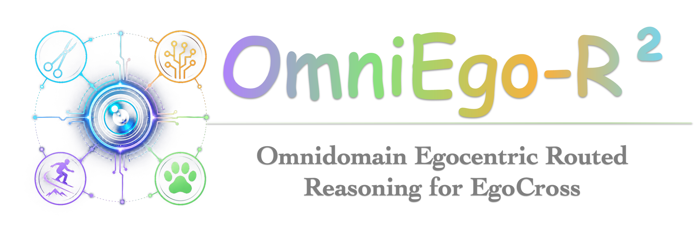
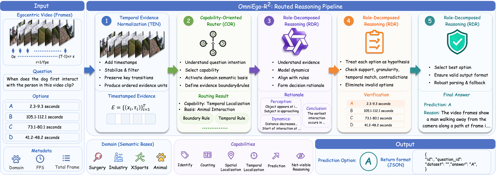

<a id="top"></a>
<div align="center">
  
  <h1>[CVPR 2026 EgoCross Challenge @ EgoVis] OmniEgo-R²: Omnidomain Egocentric Routed Reasoning for EgoCross</h1>

  <p>
    <a href="https://egocross-benchmark.github.io/"></a>
    <a href="https://arxiv.org/abs/2605.24481v1"></a>
    <a href="https://lee-zixu.github.io"></a>
    <a href="https://huggingface.co/datasets/myuniverse/EgoCross"></a>
    <a href="https://github.com/MyUniverse0726/EgoCross"></a>
    <a href="https://pytorch.org/get-started/locally/"></a>
    
  </p>

  <p>
    <b>Challenge Repository:</b> A unified routed reasoning pipeline for the 1st Cross-Domain EgoCross Challenge at CVPR 2026.
  </p>
</div>

## 📌 Introduction

**OmniEgo-R²** (**Omni**domain **Ego**centric **R**outed **R**easoning) is our challenge solution for cross-domain egocentric video question answering on EgoCross. Instead of treating Surgery, Industry, XSports, and Animal Perspective as four unrelated scripts, this repository organizes the submitted inference system into a unified test-time reasoning pipeline aligned with our technical report.

The pipeline is built on official domain-specific Qwen3-VL-4B-SFT checkpoints and wraps them with lightweight reasoning programs for timestamped evidence normalization, capability/domain routing, role-decomposed reasoning, boundary-aware option verification, and defensive answer calibration. The original domain experts are preserved in separate scripts, while `run_omniego_r2_pipeline.py` provides a single reproducible entry point.

[⬆ Back to top](#top)

## 📢 News

* **[2026-05-27]** 🔥 We release the organized OmniEgo-R² inference pipeline for the EgoCross challenge codebase.
* **[2026-05-14]** 🏆 OmniEgo-R² ranked **2nd** in both the Source-Limited and Open-Source tracks of the 1st Cross-Domain EgoCross Challenge.

[⬆ Back to top](#top)

## ✨ Key Features

- 🧭 **Temporal Evidence Normalization (TEN)**: Converts sampled egocentric frames into timestamped evidence units and preserves domain-specific FPS rules, including Surgery-specific 1 FPS cases.
- 🧩 **Capability-Oriented Router (COR)**: Routes each question by dataset/domain and capability, covering identification, counting, localization, prediction, and not-visible reasoning.
- 👥 **Role-Decomposed Reasoning (RDR)**: Reuses the original multi-agent reasoning paths for Animal and XSports, while preserving compact expert verification for Industry and Surgery.
- 🔍 **Boundary-aware Option Verification (BOV)**: Treats each multiple-choice option as a hypothesis and checks evidence support, temporal compatibility, granularity, and contradictions through domain-specific prompts.
- 🛡️ **Defensive Answer Calibration (DAC)**: Recovers a valid `A/B/C/D` answer through robust JSON/regex parsing and emits both clean submission JSON and debug JSON.
- 🧪 **Non-destructive Code Organization**: Keeps `run_animal.py`, `run_xsports.py`, `run_industry.py`, and `run_surgery.py` intact for comparison, and adds a unified wrapper instead of rewriting original files.

[⬆ Back to top](#top)

## 🏗️ Pipeline Overview

<p align="center">
  
  <figcaption><strong>Figure 1.</strong> Overview of OmniEgo-R². Domains are expressed as semantic bases plugged into a shared evidence normalization, capability grounding, structured reasoning, option verification, and answer calibration pipeline. </figcaption>
</p>

[⬆ Back to top](#top)

## 🏃‍♂️ Challenge Results

Our final submissions achieved the following EgoCross CloseQA leaderboard results:

| Track | Animal | XSports | Industry | Surgery | Overall | Rank |
|---|---:|---:|---:|---:|---:|---:|
| Source-Limited | 74.32 | 54.47 | 81.22 | 58.66 | 66.35 | 2nd |
| Open-Source | 74.32 | 54.47 | 82.86 | 58.66 | 66.77 | 2nd |

[⬆ Back to top](#top)

---

## Table of Contents

- [Introduction](#-introduction)
- [News](#-news)
- [Key Features](#-key-features)
- [Pipeline Overview](#️-pipeline-overview)
- [Challenge Results](#️-challenge-results)
- [Install](#-install)
- [Data Preparation](#-data-preparation)
- [Model Preparation](#-model-preparation)
- [Quick Start](#-quick-start)
  - [Unified OmniEgo-R² Pipeline](#1-unified-omniego-r²-pipeline)
  - [Run a Single Domain](#2-run-a-single-domain)
  - [Run Original Domain Scripts](#3-run-original-domain-scripts)
- [Project Structure](#-project-structure)
- [Acknowledgement](#-acknowledgement)
- [Contact](#️-contact)
- [Citation](#️-citation)

---

## 📦 Install

**1. Enter the repository**

After cloning or unpacking this repository, enter the inference-code directory:

```bash
# From the repository root
cd OmniEgo-R²
```

**2. Setup Python Environment**

The inference code is based on PyTorch, Hugging Face Transformers, Qwen-VL utilities, and PEFT. We recommend using an isolated Conda environment:

```bash
conda create -n omniego-r2 python=3.10 -y
conda activate omniego-r2

# Install PyTorch according to your CUDA version.
# Example for CUDA 12.1 wheels:
pip install torch torchvision torchaudio --index-url https://download.pytorch.org/whl/cu121

# Install core dependencies.
pip install transformers accelerate peft qwen-vl-utils tqdm pillow
```

> **Note:** The submitted environment used CUDA GPUs and bfloat16 inference. Please install a PyTorch build compatible with your local CUDA driver.

[⬆ Back to top](#top)

-----

## 📂 Data Preparation

This repository uses the official EgoCross data organization. Please download the dataset from the [HuggingFace EgoCross page](https://huggingface.co/datasets/myuniverse/EgoCross) or follow the official [EgoCross repository](https://github.com/MyUniverse0726/EgoCross).

EgoCross contains two complementary parts:

- `egocross_testbed/`: benchmark testbed for evaluation, including the `egocross_testbed_imgs.json` test query file.
- `EgoCross_support_set/`: support-set training data for model adaptation.

### Benchmark Testbed

The benchmark couples egocentric videos from five public sources:

| Source Dataset | Routed Domain |
|---|---|
| `CholecTrack20` | Surgery |
| `EgoSurgery` | Surgery |
| `EgoPet` | Animal |
| `ENIGMA` | Industry |
| `ExtrameSportFPV` | XSports |

It provides **957** multiple-choice QA pairs across four reasoning categories:

| Category | QA pairs |
|---|---:|
| Counting | 114 |
| Localization | 284 |
| Identification | 398 |
| Prediction | 161 |

Frames are stored as JPEG files and referenced by `video_path` in `egocross_testbed_imgs.json`. Unless otherwise noted, frames are sampled at **0.5 FPS**. `CholecTrack20` videos `VID25` and `VID111`, and all `EgoSurgery` clips, are provided at **1 FPS**.

<details>
<summary><b>Click to expand: EgoCross Testbed Directory Structure</b></summary>

```text
egocross_testbed/
├── egocross_testbed_imgs.json
├── CholecTrack20/
│   └── generated/
│       └── VIDxx/frames/<qid>/frame_00000.jpg ...
├── EgoSurgery/
│   └── generated/
│       └── xx/frames/<qid>/frame_00000.jpg ...
├── ENIGMA/
│   └── generated/
│       └── xxx/frames/<qid>/frame_00000.jpg ...
├── ExtrameSportFPV/
│   └── generated/
│       └── VIDxxx/frames/<qid>/frame_00000.jpg ...
└── EgoPet/
    └── generated/
        └── xxx/frames/<qid>/frame_00000.jpg ...
```

</details>

### QA Annotation Format

The benchmark query file is stored at:

```text
egocross_testbed/egocross_testbed_imgs.json
```

Each QA item follows the schema below:

- `id`, `dataset`, `question_id`
- `primary_category`, `question_type`
- `question_text`, `options`
- `correct_option_letter`, `answer_text`, `detailed_answer`
- `original_video_fps`
- `video_path` (list of frame paths)

### Support Set

The support set contains **80** multi-choice QA samples in ShareGPT multimodal format:

| Domain | Source | Samples |
|---|---|---:|
| Animal | EgoPet | 20 |
| Industry | ENIGMA | 20 |
| XSports | ExtrameSportFPV | 20 |
| Surgery | CholecTrack20 | 20 |

Important files:

```text
EgoCross_support_set/
├── train.json
├── train_animal.json
├── train_industry.json
├── train_xsports.json
├── train_surgery.json
├── dataset_info.json
└── frames/
```

`dataset_info.json` is included for LLaMA-Factory style loading with ShareGPT formatting.

[⬆ Back to top](#top)

-----

## 🤖 Model Preparation

The inference scripts expect four domain-specific Qwen3-VL-4B-SFT checkpoints. By default, the unified pipeline searches for:

```text
./EgoCross-main/models/
├── animal/
├── xsports/
├── industry/
└── surgery/
```

The default mapping in `run_omniego_r2_pipeline.py` is:

| Domain | Default checkpoint path |
|---|---|
| Animal | `./EgoCross-main/models/animal` |
| XSports | `./EgoCross-main/models/xsports` |
| Industry | `./EgoCross-main/models/industry` |
| Surgery | `./EgoCross-main/models/surgery` |

If your checkpoints are stored elsewhere, pass per-domain overrides with `--model`:

```bash
python run_omniego_r2_pipeline.py \
  --model Animal=/path/to/models/animal \
  --model XSports=/path/to/models/xsports \
  --model Industry=/path/to/models/industry \
  --model Surgery=/path/to/models/surgery
```

[⬆ Back to top](#top)

-----

## 🚀 Quick Start

### 1. Unified OmniEgo-R² Pipeline

The recommended entry point is the unified wrapper:

```bash
python run_omniego_r2_pipeline.py
```

By default, the script automatically searches for:

```text
datasets/egocross_testbed_imgs.json
# or
egocross_testbed_imgs.json

submission_template.json
# or
merged_all_answers_ours.json
```

It produces two files:

```text
submission_omniego_r2.json          # clean submission file
submission_omniego_r2_debug.json    # debug file with raw reasoning outputs
```

For explicit paths:

```bash
python run_omniego_r2_pipeline.py \
  --testbed /path/to/egocross_testbed/egocross_testbed_imgs.json \
  --submission /path/to/submission_template.json \
  --dataset-root /path/to/egocross_testbed \
  --output submission_omniego_r2.json \
  --debug-output submission_omniego_r2_debug.json
```

> **Important:** `--dataset-root` should point to the local directory corresponding to `/egocross_testbed/` in the JSON frame paths.

### 2. Run a Single Domain

To run only one domain:

```bash
python run_omniego_r2_pipeline.py --domains Animal
python run_omniego_r2_pipeline.py --domains XSports
python run_omniego_r2_pipeline.py --domains Industry
python run_omniego_r2_pipeline.py --domains Surgery
```

To run multiple domains:

```bash
python run_omniego_r2_pipeline.py --domains Animal,XSports,Industry,Surgery
```

### 3. Run Domain Scripts

The per-domain scripts are preserved for direct comparison and debugging:

```bash
python run_animal.py
python run_xsports.py
python run_industry.py
python run_surgery.py
```

Their behavior is domain-specific:

| Script | Domain | Main reasoning design |
|---|---|---|
| `run_animal.py` | Animal | Three-agent frame observation, motion analysis, and final decision |
| `run_xsports.py` | XSports | FPV sport identification, trick theory, and final referee |
| `run_industry.py` | Industry | ENIGMA controlled vocabulary and single expert verifier |
| `run_surgery.py` | Surgery | Surgical tool/phase expert with dataset-specific FPS handling |

[⬆ Back to top](#top)

-----

## 📁 Project Structure

```text
best/
├── run_omniego_r2_pipeline.py      # Unified OmniEgo-R² TEN/COR/RDR/BOV/DAC pipeline
├── run_animal.py                   # Animal domain expert: multi-agent pet egocentric reasoning
├── run_xsports.py                  # XSports domain expert: FPV physics and action reasoning
├── run_industry.py                 # Industry domain expert: ENIGMA taxonomy and small-object reasoning
├── run_surgery.py                  # Surgery domain expert: surgical video reasoning and FPS rules
├── test_omniego_r2_pipeline_static.py
│                                      # Lightweight static checks for the unified wrapper
└── README.md                       # This file
```

[⬆ Back to top](#top)


-----

## 🤝 Acknowledgement

We sincerely thank the authors of [EgoCross](https://github.com/MyUniverse0726/EgoCross) for building the cross-domain egocentric video QA benchmark and releasing the dataset. We also acknowledge the open-source communities behind PyTorch, Hugging Face Transformers, Qwen-VL utilities, and PEFT.

[⬆ Back to top](#top)

## ✉️ Contact

For questions, issues, or feedback, please open an issue in this repository or contact the authors of the technical report.

[⬆ Back to top](#top)

## 📝⭐️ Citation

If you find this challenge solution useful, please consider citing the EgoCross benchmark and our technical report.

```bibtex
@article{omniegor2_cvpr2026_challenge,
  title={OmniEgo-R$^2$: A Routed Reasoning Framework for the 1st Cross-Domain EgoCross Challenge at CVPR 2026}, 
  author={Zixu Li and Zhiwei Chen and Zhiheng Fu and Wenbo Wang and Yupeng Hu and Weili Guan and Liqiang Nie},
  journal={https://arxiv.org/abs/2605.24481},
  year={2026}
}

```

[⬆ Back to top](#top)


## 🫡 Support & Contributing

We welcome all forms of contributions\! If you have any questions, ideas, or find a bug, please feel free to:

  - Open an [Issue](https://github.com/Lee-zixu/OmniEgo-R2/issues) for discussions or bug reports.
  - Submit a [Pull Request](https://github.com/Lee-zixu/OmniEgo-R2/pulls) to improve the codebase.

[⬆ Back to top](#top)

<div align="center">


<br><br>

  <a href="https://github.com/Lee-zixu/OmniEgo-R2">
    
  </a>
  <a href="https://github.com/Lee-zixu/OmniEgo-R2/issues">
    
  </a>
  <a href="https://github.com/Lee-zixu/OmniEgo-R2/pulls">
    
  </a>

<br><br>

<div align="center">
  <a href="https://egocross-benchmark.github.io/">
    
  </a>
</div>
